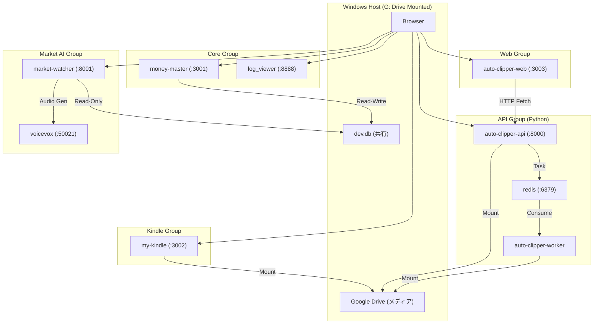

# 🏗️ システムアーキテクチャ (Antigravity Ultimate Edition)

## 📊 概要
本システムは、5つの独立したComposeファイルによって管理される9つのコンテナを持つ **分散Dockerアーキテクチャ** で動作します。

## 🔌 ポートレジストリ (予約済み)

| ポート | サービス | タイプ | プロトコル |
|--------|----------|--------|------------|
| **3001** | money-master | App | HTTP |
| **3002** | my-kindle | App | HTTP |
| **3003** | auto-clipper-web | App | HTTP |
| **8000** | auto-clipper-api | API | HTTP (FastAPI) |
| **8001** | market-watcher | API | HTTP (FastAPI) |
| **8888** | dozzle | Tool | HTTP |
| **6379** | redis | Infra | TCP |
| **50021** | voicevox | AI | HTTP |

## 📂 データ永続化戦略

- **データベース**: SQLite (`apps/money-master/prisma/dev.db`) を各コンテナにマウント。
- **メディア**: ホストの `G:/マイドライブ` を `/app/output`, `/app/library` にマウント。
- **クッキー**: `apps/auto-clipper-api/cookies.txt` (YouTubeアクセスに必須)。
