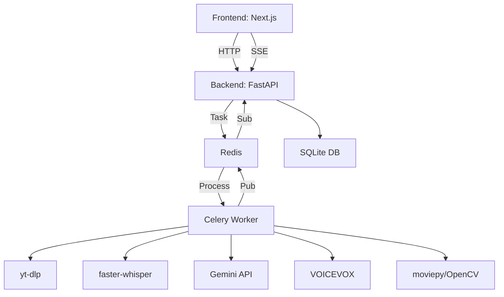

# Auto-Clipper - Technical Specification

Auto-ClipperのFrontend (Next.js) とBackend (FastAPI) の統合仕様を記述します。

---

## Architecture Overview



**Ports**:
- Frontend: `3002`
- Backend: `8000`
- Redis: `6379`
- VOICEVOX: `50021`

---

## API Endpoints

### 1. POST `/process`

YouTube URLを受け取り、動画をダウンロード・分析。

**Request**:
```json
{
  "url": "https://www.youtube.com/watch?v=VIDEO_ID"
}
```

**Response**:
```json
{
  "id": "uuid-job-id",
  "status": "pending",
  "url": "https://..."
}
```

**Status Flow**:
`pending` → `downloading` → `transcribing` → `analyzing` → `waiting_for_selection`

---

### 2. GET `/status/{job_id}`

ジョブのステータスと候補を取得。

**Response**:
```json
{
  "id": "uuid",
  "status": "waiting_for_selection",
  "candidates": [
    {
      "start": 120.5,
      "end": 180.2,
      "reason": "笑いの沸き立つジョーク",
      "narration_script": "ここが面白い!",
      "thumbnail_title": "爆笑シーン"
    }
  ],
  "result_path": null
}
```

---

### 3. GET `/events/{job_id}` (New!)

Server-Sent Events (SSE) によるリアルタイムステータス更新。

**Response Stream**:
```text
data: {"id": "...", "status": "downloading", ...}
```

---

### 4. POST `/render/{job_id}`

選択したクリップを動画として生成。

**Request**:
```json
{
  "start": 120.5,
  "end": 180.2,
  "vertical_mode": true,
  "subtitles": true,
  "use_narration": true,
  "narration_script": "...",
  "use_thumbnail": true,
  "thumbnail_title": "爆笑"
}
```

**Status Flow**:
`editing` → `completed`

**Result**:
- `result_path`: `/temp/{job_id}_clip.mp4`
- `thumbnail_url`: `/temp/{job_id}_thumb.jpg`

---

### 5. POST `/digest/{job_id}`

総集編動画を生成 (5分間のダイジェスト)。

**Request**:
```json
{
  "duration_minutes": 5,
  "model_name": "gemini-2.5-flash-preview-09-2025"
}
```

**Status Flow**:
`planning_digest` → `editing_digest` → `completed`

---

## Data Models

### Job (SQLite)

```python
class Job:
    id: str             # UUID
    url: str            # YouTube URL
    status: str         # "pending", "downloading", ...
    video_path: str     # ローカル動画パス
    title: str          # 動画タイトル
    result_path: str    # 完成動画パス
    thumbnail_url: str  # サムネイルURL
    candidates: list    # JSON [{start, end, reason, ...}]
    transcript: list    # JSON [{start, end, text, ...}]
    created_at: datetime
```

---

## AI Processing Pipeline

### 1. Download (yt-dlp)

```python
from utils.downloader import download_video

video_path, title = download_video(url, job_id)
# Output: temp/{job_id}_video.mp4
```

**Cookie Support**: `cookies.txt`でYouTube認証を突破

---

### 2. Transcribe (faster-whisper)

```python
from utils.transcriber import transcribe_audio

segments = transcribe_audio(video_path)
# segments: [{"start": 0.0, "end": 5.2, "text": "こんにちは"}]
```

**Model**: `large-v3` (CUDA対応)

---

### 3. Analyze (Gemini)

```python
from utils.llm_analyzer import analyze_transcript_semantics

candidates = analyze_transcript_semantics(segments)
# candidates: [{"start": 120, "end": 180, "reason": "...", "narration_script": "...", "thumbnail_title": "..."}]
```

**Gemini Prompt**:
- "面白い瞬間、ジョーク、盛り上がりを最大3つ検出"
- "各候補に`reason`, `narration_script`, `thumbnail_title`を付与"

**Fallback**: LLM失敗時は音声解析 (RMS/ZCR) にフォールバック

---

### 4. Crop & Render (moviepy + OpenCV)

```python
from utils.editor import create_clip

create_clip(
    video_path, start, end, output_path,
    subtitles=transcript,
    vertical_mode=True,  # 9:16クロップ
    narration_audio_path="narration.wav"
)
```

**Features**:
- スマートクロップ: OpenCV顔認識 → 中心配置
- 字幕: Pillow + 日本語フォント (MS Gothic, Yu Gothic)
- AI解説: VOICEVOXで生成した音声を合成

---

### 5. Thumbnail Generation

```python
from utils.thumbnail_generator import generate_thumbnail
from utils.smart_cropper import extract_best_frame

frame = extract_best_frame(video_path, start, end)
generate_thumbnail(frame, thumbnail_title, output_path)
```

---

### 6. Digest (Auto-Digest)

```python
from utils.llm_analyzer import generate_digest_script
from utils.digest_maker import create_digest_video

script = generate_digest_script(transcript, duration_minutes=5)
# script: [{"start": 10, "end": 40, "summary": "見どころ1"}, ...]

create_digest_video(video_path, script, output_path)
```

**処理**:
1. Gemini が `duration_minutes` 分に収まる構成案を作成
2. 各セグメントをクロスフェードで結合

---

## Frontend Integration (TanStack Query + SSE)

### Job Lifecycle Management

```typescript
import { useMutation } from '@tanstack/react-query';
import { useJobStream } from '@/hooks/use-job-stream';

// ジョブ作成
const createJobMutation = useMutation({
  mutationFn: (url: string) => fetch('/api/process', {
    method: 'POST',
    body: JSON.stringify({ url })
  })
});

// リアルタイムステータス更新 (SSE)
const { data: job, isConnected } = useJobStream(jobId);
```

---

## File Storage

### Local (temp/)

- `{job_id}_video.mp4`: ダウンロード済み動画
- `{job_id}_clip.mp4`: 完成動画
- `{job_id}_thumb.jpg`: サムネイル
- `{job_id}_narration.wav`: AI解説音声
- `{job_id}.json`: 文字起こしキャッシュ

### Google Drive (rclone)

完成動画を `/mnt/gdrive/Clips/` に自動保存:
- `{title}_clip_{job_id}.mp4`
- `{title}_thumb_{job_id}.jpg`

---

## Error Handling

### YouTube認証エラー (403/Sign in required)

**Solution**: `cookies.txt` を使用

```bash
# 拡張機能 "Get cookies.txt LOCALLY" でCookie取得
# backend/cookies.txt に保存
```

---

### 話者分離失敗

**Pyannote.audio** が失敗しても音声解析にフォールバック。

**Requirements**:
- Hugging Face Token (`HF_TOKEN`)
- モデルアクセス許可: `pyannote/speaker-diarization-3.1`

---

## Performance Optimization

1. **キャッシュ**: 一度文字起こしした動画は`.json`でキャッシュ
2. **非同期処理**: Celery + Redisによるバックグラウンド処理
3. **リアルタイム更新**: SSEによるポーリング負荷削減
4. **CUDA最適化**: faster-whisper, pyannote.audioでGPU使用

---

## Environment Variables

### Backend (`auto-clipper-api/.env`)

```env
GEMINI_API_KEY=your_gemini_api_key
HF_TOKEN=your_hugging_face_token
VOICEVOX_URL=http://voicevox:50021
```

### Frontend (`auto-clipper-web/.env`)

```env
NEXT_PUBLIC_API_URL=http://localhost:8000
```

---

## Future Enhancements

- **Batch Processing**: 複数URLの一括処理
- **Custom Models**: Whisperモデル選択UI
- **Advanced Cropping**: 話者追跡の精度向上
- **Export Presets**: YouTube Shorts, TikTok, Instagramプリセット
