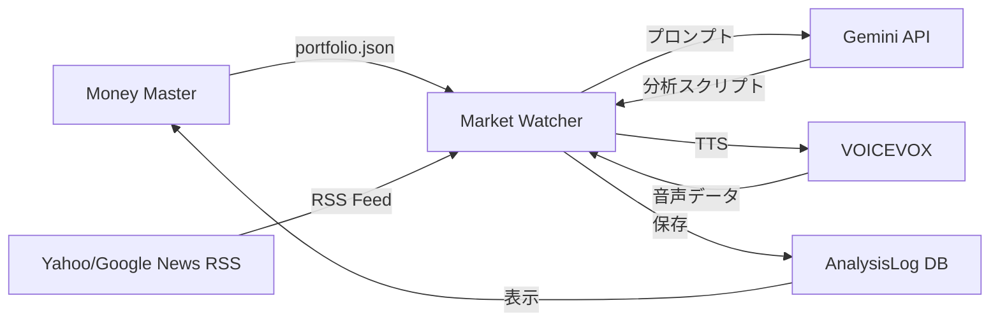

# Market Watcher - 技術仕様書

AI市場分析エンジンの技術仕様を記述します。

---

## アーキテクチャ



---

## データソース

### 1. ポートフォリオデータ (`portfolio.json`)

Money Masterから読み込みます。

**場所**: `/data/portfolio.json` (Dockerボリュームマウント)

**フォーマット**:
```json
{
  "assets": [
    {
      "ticker": "7203.T",
      "name": "トヨタ自動車",
      "quantity": 100,
      "currentPrice": 2500,
      "currency": "JPY"
    }
  ]
}
```

---

### 2. ニュース RSS フィード

**ソース**:
- Yahoo!ファイナンス ニュース
- Google ニュース (ファイナンス)

**実装**: `src/news.py`

```python
import feedparser

def fetch_news():
    feeds = [
        "https://news.yahoo.co.jp/rss/topics/business-all.xml",
        "https://news.google.com/rss/search?q=finance"
    ]
    entries = []
    for url in feeds:
        feed = feedparser.parse(url)
        entries.extend(feed.entries)
    return entries
```

---

## AI 分析エンジン

### Gemini API 統合

**ファイル**: `src/analyst.py`

**モデル**: `gemini-2.5-flash-preview-09-2025`

### プロンプトエンジニアリング

```python
import google.generativeai as genai

def analyze_market(portfolio, news):
    prompt = f"""
あなたは辛口の金融アナリスト「ずんだもん」です。
ポッドキャスト風の口調で市場分析を行ってください。

【ポートフォリオ】
{portfolio}

【最新ニュース】
{news}

以下の形式でJSONを返してください:
{{
  "title": "レポートタイトル",
  "summary": "要約 (100文字)",
  "script": "ずんだもん口調のスクリプト (500-800文字)",
  "sources": ["ニュースURL1", "ニュースURL2"]
}}
    """
    
    response = genai.GenerativeModel('gemini-2.5-flash-preview-09-2025').generate_content(prompt)
    return parse_response(response.text)
```

**ポイント**:
- **ペルソナ**: 辛口、ポッドキャスト風
- **コンテキスト**: ポートフォリオとニュースを関連付け
- **出力**: JSONで構造化データを返す

---

## 音声合成 (VOICEVOX)

**ファイル**: `src/tts.py`

### API 統合

```python
import requests

class TTSService:
    def __init__(self, base_url="http://voicevox:50021"):
        self.base_url = base_url
    
    def generate_audio(self, text, speaker=3):  # 3 = ずんだもん
        # 1. 音声合成用クエリ作成
        query = requests.post(
            f"{self.base_url}/audio_query",
            params={"text": text, "speaker": speaker}
        ).json()
        
        # 2. 音声合成
        audio = requests.post(
            f"{self.base_url}/synthesis",
            params={"speaker": speaker},
            json=query
        ).content
        
        return audio  # WAV bytes
```

**話者 ID**: `3` (ずんだもん)

---

## データ永続化

### AnalysisLog モデル (Prisma)

Money Masterの`money-master.db`に保存します:

```prisma
model AnalysisLog {
  id      String   @id @default(uuid())
  date    String
  title   String
  summary String
  script  String
  sources String   // JSON string: ["url1", "url2"]
}
```

### 分析結果の保存

```python
import json
from datetime import datetime

def save_analysis(title, summary, script, sources):
    # Money MasterのDB接続
    conn = sqlite3.connect('/data/money-master.db')
    cursor = conn.cursor()
    
    cursor.execute('''
        INSERT INTO AnalysisLog (id, date, title, summary, script, sources)
        VALUES (?, ?, ?, ?, ?, ?)
    ''', (
        str(uuid.uuid4()),
        datetime.now().isoformat(),
        title,
        summary,
        script,
        json.dumps(sources)
    ))
    conn.commit()
```

---

## API エンドポイント

### 1. POST `/analyze/daily`

テキストレポートを生成します。

**レスポンス**:
```json
{
  "title": "今日の市場分析",
  "summary": "ハイテク株主導の上昇...",
  "script": "（ずんだもん口調のスクリプト）",
  "sources": ["https://news.yahoo.co.jp/..."]
}
```

---

### 2. POST `/analyze/audio`

音声レポートを生成してWAV形式で返します。

**レスポンス**: `audio/wav` (バイナリ)

**使用法**:
```bash
curl -X POST http://localhost:8001/analyze/audio --output report.wav
```

---

## 定期実行 (Cron)

**将来の拡張**: 毎日午前9時に自動分析

```python
import schedule
import time

def daily_analysis():
    # 分析実行
    result = analyze_market(...)
    save_analysis(...)
    generate_audio(...)

schedule.every().day.at("09:00").do(daily_analysis)

while True:
    schedule.run_pending()
    time.sleep(60)
```

**Docker対応**: `docker-compose.yml`で`command`を設定

---

## エラーハンドリング

### Gemini API エラー

```python
try:
    response = genai.generate_content(prompt)
except Exception as e:
    logger.error(f"Gemini API failed: {e}")
    # フォールバックロジック: 簡易サマリー生成
    return {"title": "API Error", "summary": "分析失敗", ...}
```

---

## 環境変数

```env
GEMINI_API_KEY=your_gemini_api_key
VOICEVOX_URL=http://voicevox:50021
PORTFOLIO_PATH=/data/portfolio.json
```

---

## モニタリング & ログ

```python
import logging

logging.basicConfig(
    level=logging.INFO,
    format='%(asctime)s - %(name)s - %(levelname)s - %(message)s'
)

logger = logging.getLogger(__name__)
logger.info("Market analysis started")
```

---

## 今後の拡張

- **多言語対応**: 英語レポート対応
- **カスタムニュースソース**: ユーザー定義のRSSフィード追加
- **センチメント分析**: ニュースの感情分析追加
- **メールアラート**: 重要なニュース時のメール通知
