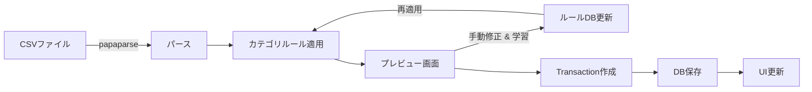
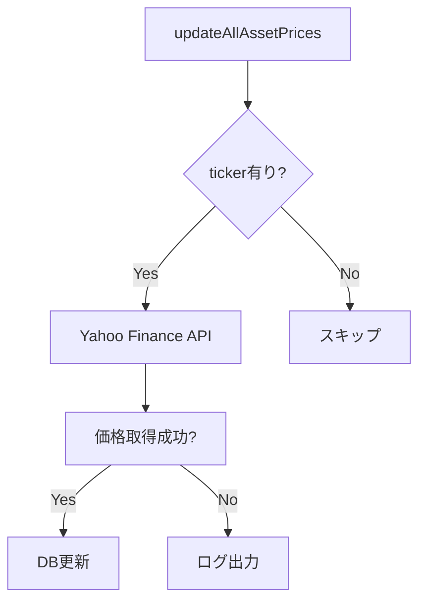
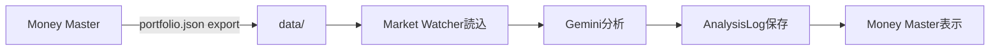

# Money Master - Technical Specification

本ドキュメントでは、Money Masterアプリケーションの技術仕様、データモデル、API設計、処理フローを詳述します。

---

## データベース設計 (Prisma SQLite)

### Schema Overview

Money MasterはPrisma ORMとSQLiteデータベースを使用してデータを管理します。

**データベースファイル**: `data/money-master.db`

### Models

#### Asset (資産)

資産情報を管理。株式、投資信託、ETF、現金などのすべての金融資産を含みます。

```prisma
model Asset {
  id               String   @id @default(uuid())
  ticker           String?       // ティッカーシンボル (例: "7203.T", "AAPL")
  name             String        // 資産名
  type             String        // "Stock", "Cash", "InvestmentTrust", "ETF"
  account          String?       // "TOKUTEI", "NISA_TSUMITATE", "NISA_GROWTH"
  quantity         Float?        // 保有数量
  avgCost          Float?        // 平均取得単価
  currency         String        // "JPY" or "USD"
  currentPrice     Float?        // 現在価格 (Yahoo Finance APIから取得)
  dividendRate     Float?        // 配当金額 (1株あたり)
  dividendYield    Float?        // 配当利回り (%)
  nextDividendDate String?       // 次回配当支払日 (ISO 8601)
  sector           String?       // セクター (例: "Technology", "Finance")
  manualPrice      Float?        // 手動設定価格 (APIで取得できない場合)
  balance          Float?        // 現金残高 (type="Cash"の場合)
  description      String?       // メモ
  createdAt        DateTime @default(now())
  updatedAt        DateTime @updatedAt
  isArchived       Boolean  @default(false)

  transactions     Transaction[]
  dividends        Dividend[]

  @@index([type])
  @@index([isArchived, createdAt])
}
```

**インデックス**:
- `type`: 資産タイプでのフィルタリング最適化
- `isArchived, createdAt`: アーカイブされていない資産の効率的な取得

---

#### Transaction (取引)

収入、支出、投資などすべての金融取引を記録。

```prisma
model Transaction {
  id          String   @id @default(uuid())
  date        String       // ISO 8601 (YYYY-MM-DD)
  amount      Float        // 金額 (正: 収入、負: 支出)
  type        String       // "Income", "Expense", "Investment"
  category    String       // "Salary", "Food", "Transport", "StockPurchase"
  description String?      // 取引内容
  assetId     String?      // 関連する資産ID (任意)
  createdAt   DateTime @default(now())

  asset       Asset?   @relation(fields: [assetId], references: [id])

  @@index([date])
  @@index([type])
  @@index([assetId])
}
```

---

#### Dividend (配当)

資産ごとの配当金受取記録。

```prisma
model Dividend {
  id        String   @id @default(uuid())
  assetId   String
  date      String       // 配当受取日 (ISO 8601)
  amount    Float        // 配当金額
  currency  String       // "JPY" or "USD"

  asset     Asset    @relation(fields: [assetId], references: [id])

  @@index([date])
  @@index([assetId])
}
```

---

#### HistoryEntry (資産履歴)

日次の総資産評価額を記録。チャート表示に使用。

```prisma
model HistoryEntry {
  id         String   @id @default(uuid())
  date       String   @unique  // ISO 8601 (YYYY-MM-DD)
  totalValue Float             // 総資産評価額
  totalCost  Float             // 総投資額 (原価)
  totalPL    Float             // 損益 (Profit/Loss)
}
```

---

#### AnalysisLog (AI分析ログ)

Market WatcherからのAI市場分析結果を保存。

```prisma
model AnalysisLog {
  id      String   @id @default(uuid())
  date    String       // 分析日時
  title   String       // レポートタイトル
  summary String       // 要約
  script  String       // 音声スクリプト (ずんだもん)
  sources String       // JSON string (ニュースソース配列)
}
```

---

#### CategoryRule (カテゴリルール)

CSV importでの自動カテゴリ分類ルール。

```prisma
model CategoryRule {
  id       String @id @default(uuid())
  pattern  String @unique  // 正規表現パターン
  category String          // 割り当てるカテゴリ
}
```

---

## Server Actions API

Money MasterはNext.js Server Actionsを使用してデータ操作を実行します。

**ファイル**: `src/lib/actions.ts`

### Asset Actions

#### `getAssets()`
全資産を取得 (アーカイブ除外)。

**Returns**: `Promise<Asset[]>`

```typescript
export async function getAssets() {
  const assets = await prisma.asset.findMany({
    where: { isArchived: false },
    orderBy: { createdAt: 'desc' },
    select: {
      id: true, name: true, type: true, ticker: true,
      quantity: true, currentPrice: true, currency: true, ...
    }
  });
  return assets;
}
```

---

#### `createAsset(data: AssetFormData)`
新規資産を作成。

**Parameters**:
- `name`: 資産名
- `type`: 資産タイプ
- `ticker?`: ティッカーシンボル
- `quantity?`: 数量
- `avgCost?`: 平均取得単価

**Returns**: `Promise<{success: boolean, error?: string, asset?: Asset}>`

---

#### `updateAsset(id: string, data: AssetFormData)`
既存資産を更新。

---

#### `archiveAsset(id: string)`
資産をアーカイブ (論理削除)。

---

### Transaction Actions

#### `getTransactions(filters?: {type?, category?, startDate?, endDate?})`
取引履歴を取得。フィルタリング対応。

#### `getCategoryRules()`
全カテゴリルールを取得。

**Returns**: `Promise<CategoryRule[]>`

---

#### `addCategoryRule(pattern: string, category: string)`
新規ルールを追加または更新。

**Parameters**:
- `pattern`: キーワード（部分一致）
- `category`: カテゴリ名

**Returns**: `Promise<{success: boolean, data?: CategoryRule, error?: string}>`

---

#### `deleteCategoryRule(id: string)`
ルールを削除。

---

### Price Update Actions

#### `updateAllAssetPrices()`
全資産の現在価格をYahoo Finance APIから一括取得・更新。

**処理フロー**:
1. `isArchived = false` かつ `ticker != null` の資産を取得
2. 5-10並列でYahoo Finance API (`yahoo-finance2`)にリクエスト
3. `Promise.allSettled`で堅牢なエラーハンドリング
4. `currentPrice`, `dividendRate`, `dividendYield` を更新

**エラーハンドリング**:
- APIエラー時はスキップしてログ出力
- 部分的な成功でも他の資産を処理継続

---

## Data Flow

### CSV Import Flow



**実装**: `src/app/import/page.tsx`, `src/components/import/ImportPreview.tsx`

**対応フォーマット**:
- 楽天証券取引履歴 (`RB-torihikimeisai.csv`)
- カスタムCSV (日付, 金額, カテゴリ, 説明)
- **学習機能**: プレビュー画面でカテゴリ修正をルールとして保存可能

---

### Price Update Flow



---

### Market Watcher Integration



**データ連携**:
- `data/portfolio.json`: Market Watcher用にエクスポート
- `AnalysisLog`テーブル: Market Watcherが分析結果を保存
- `AIAnalystWidget`: ダッシュボードで最新分析を表示

---

## Yahoo Finance Integration

**ライブラリ**: `yahoo-finance2`

### 価格取得

```typescript
import yahooFinance from 'yahoo-finance2';

// 単一銘柄
const quote = await yahooFinance.quote('7203.T');
// quote.regularMarketPrice, quote.dividendRate, quote.dividendYield

// 米国株
const usQuote = await yahooFinance.quote('AAPL');
```

### ティッカーシンボル形式

- **日本株**: `{コード}.T` (例: `7203.T` = トヨタ)
- **米国株**: シンボルのみ (例: `AAPL`)
- **投資信託**: Yahoo Financeで検索して取得

---

## USD/JPY 為替レート

**自動取得**: `USDJPY=X` ティッカーでYahoo Financeから取得

```typescript
const fxQuote = await yahooFinance.quote('USDJPY=X');
const usdJpyRate = fxQuote.regularMarketPrice;
```

**用途**:
- 米国株の評価額をJPY換算
- 配当金のJPY換算

---

## Backup & Restore

### データベースバックアップ

```bash
# Docker環境
docker-compose -f docker-compose-drivestream.yml cp \
  money-master:/app/apps/money-master/data/money-master.db \
  ./backups/money-master-$(date +%Y%m%d).db

# Windowsホスト
Copy-Item apps\money-master\data\money-master.db `
  -Destination ".\backups\money-master-$(Get-Date -Format 'yyyyMMdd').db"
```

### レガシーJSON Export (Market Watcher連携用)

`data/portfolio.json`, `data/transactions.json` は Market Watcher が読み込むため残されています。

**Export スクリプト**: 定期的にPrisma DBから JSON にエクスポート (未実装の場合は手動)

---

## Performance Optimization

### Implemented

1. **Database Indexing**: `type`, `isArchived`, `date` にインデックス
2. **Prisma Select**: 必要なフィールドのみ取得
3. **Parallel Price Fetch**: 並列リクエスト (5-10 concurrent)
4. **Next.js Caching**: `unstable_cache` + `revalidateTag` (実装済み確認)

### Recommendations

- **Pagination**: 取引履歴が1000件超える場合はpagination追加
- **Price Cache**: 価格更新を1日1回に制限 (現在は手動更新)

---

## Environment Variables

```env
DATABASE_URL="file:./data/money-master.db"
```

---

## Future Enhancements

- **Scheduled Price Updates**: cron job for daily price updates
- **Multi-currency Support**: より多くの通貨ペアに対応
- **Export to Excel**: レポートをExcel形式でエクスポート
- **Tax Calculation**: 確定申告用の損益計算機能
